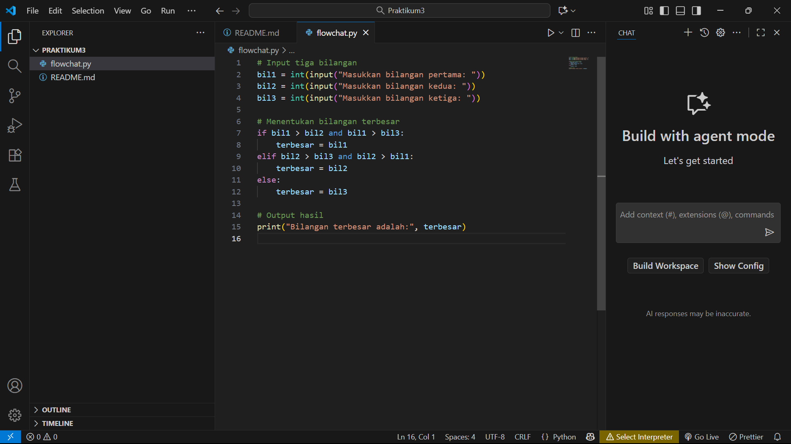
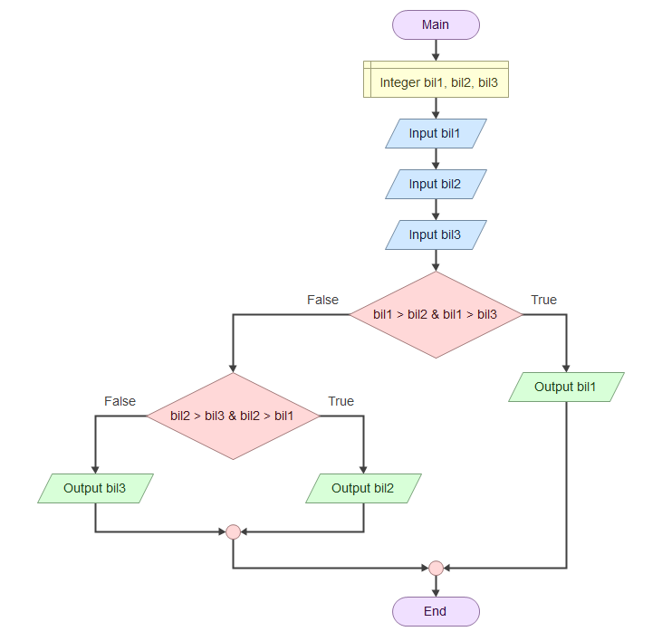

# Praktikum3

## 1. buat repository baru lalu kita clone di git bash

## 2. buat file python untuk mencari bilangan terbesar dari tiga input

## penjelasan code python

 Program meminta pengguna memasukkan tiga bilangan.

Fungsi input() digunakan untuk menerima data dari keyboard.

int() digunakan untuk mengubah input (yang berupa teks) menjadi angka bulat (integer).

if: Mengecek apakah bil1 lebih besar dari bil2 dan bil3.
→ Jika benar, berarti bil1 adalah yang terbesar.

elif (else if): Kalau kondisi pertama salah, dicek apakah bil2 lebih besar dari dua bilangan lainnya.
→ Jika benar, berarti bil2 adalah yang terbesar.

else: Jika dua kondisi sebelumnya salah, maka otomatis bil3 yang paling besar.

Menampilkan hasil akhir ke layar dengan teks "Bilangan terbesar adalah:" diikuti nilainya.

## 3. flowchart menentukan bilangan terbesar dari tiga input

